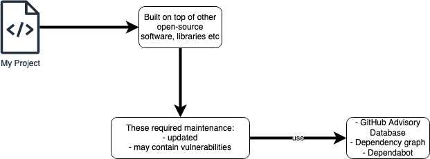

## Configure security




- [dependency graph](./dependecy-graph.md)
- [GitHub Advisory Database](./github-advisory-database.md)
- [Dependabot](./dependabot.md)

---

You can get notified via email, on the UI, on the CLI (warnings are displayed as callbacks)


### GraphQL

You can use GraphQL API to retrieve and export alerts. This enables you to export a list of your dependencies that can be saved as a CSV. 

Queries are structured like this:

```GraphQL
query {
  JSON objects to return
}
```