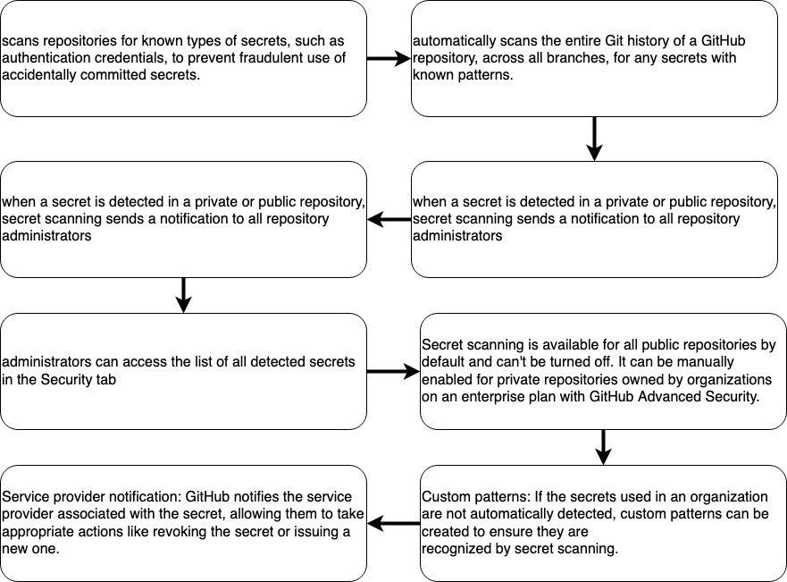

### Describe secret scanning
### Configure secret scanning
### Use secret scanning

Secret scanning



Exclude files from being scanned:
- Create a `.github/secret_scanning.yml` file 
- Use the `paths-ignore` parameter to specify the paths you want to exclude from scanning.
- You can use special characters like "*" to filter paths.

```yml
paths-ignore:
  - "foo/bar/*.js"
```

## Use secret scanning

You can define up to 500 custom patterns for each organization or enterprise account, and up to 100 custom patterns per private repository.

### What are custom patterns?

They are user-defined patterns that can be created to scan for specific secrets or sensitive information in repositories. While GitHub automatically scans for known secret patterns, custom patterns allow users to define their own unique patterns to search for specific types of secrets that may be specific to their organization or project.