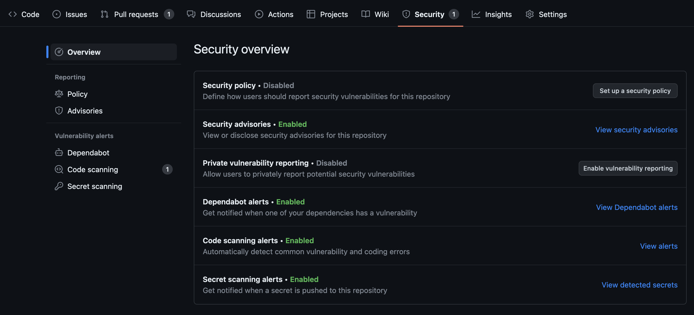
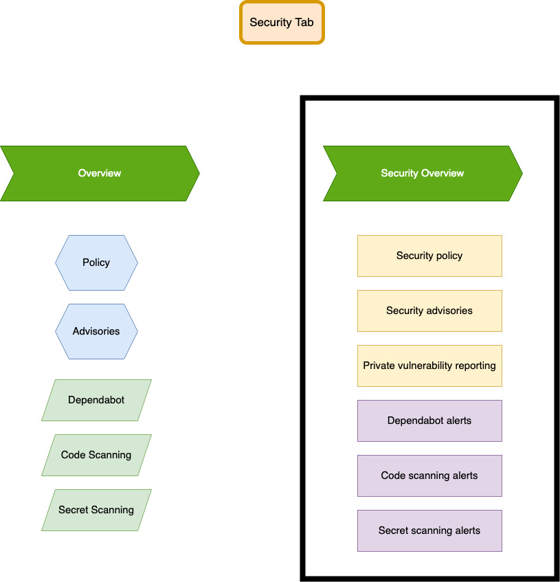

## Describe code scanning

Code scanning uses CodeQL to analyze the code in a GitHub repository to find security vulnerabilities and coding errors.

## List the steps for enabling code scanning in a repository

## List the steps for enabling code scanning with third party analysis

## Contrast how to implement CodeQL analysis in a GitHub Actions workflow versus a third party continuous integration (CI) tool

code analysis engine, can be integrated into GitHub Actions workflows or third-party continuous integration (CI) tools.

two main ways to use CodeQL analysis for code scanning:

    Add the CodeQL workflow to your repository. This uses the github/codeql-action to run the CodeQL CLI.
    Run the CodeQL CLI directly in an external CI system and upload the results to GitHub.

You generate a CodeQL database to represent your codebase, then you run CodeQL queries on that database to identify problems in the codebase.

## Explain how to configure code scanning on a repository using triggering events
## Contrast the frequency of code scanning workflows(scheduled vs triggered by events)

•	Implementing CodeQL analysis: CodeQL, a powerful code analysis engine, can be integrated into GitHub Actions workflows or third-party continuous integration (CI) tools.
•	Configuring code scanning: Details are provided on configuring code scanning by specifying triggering events that initiate code scans.
•	Frequency of code scanning workflows: A comparison is made between scheduled code scanning workflows and those triggered by events, helping determine the optimal frequency for scanning.

---

### Add the CodeQL workflow to your repository

CodeQL analysis workflow is always displayed, but the Set up this workflow option is only enabled if CodeQL analysis supports the languages present in the repository.

# Enable code scanning with third party tools

Instead of running code scanning in GitHub, you can perform analysis elsewhere and then upload the results. 

•	Static Analysis Results Interchange Format (SARIF) files are used to upload code scanning alerts from third-party tools.
•	SARIF files must be in version 2.1.0 format.
•	Code scanning alerts can be uploaded using the code scanning API, CodeQL CLI, or GitHub Actions.
•	The code scanning API allows retrieval and update of code scanning alerts and supports SARIF files in application/sarif+json format.
•	The CodeQL CLI generates a CodeQL database for code analysis and can upload results in SARIF format to GitHub.
•	GitHub Actions workflows can be used to upload SARIF files to a repository.
•	The "upload-sarif" action from the github/codeql-action repository is used in the workflow to configure the upload.
•	The main input parameter in the workflow is "sarif-file" which specifies the file or directory of SARIF files to be uploaded.
•	The upload-sarif action can be triggered by push events or scheduled events.
•	SARIF files uploaded through GitHub Actions are processed, and alerts are added to the repository.
•	GitHub uses fingerprints in SARIF files to prevent duplicate alerts.
•	SARIF file uploads have a maximum limit of 5000 results per upload and a maximum file size of 10 MB for gzip-compressed files.
•	SARIF files generated outside the repository can be uploaded using a workflow that runs when commits are pushed.
•	The upload-sarif action can be added as a step in a continuous integration (CI) workflow to upload SARIF files generated during CI testing.

### Edit code scanning workflow

•	To configure code scanning, you need to add a GitHub Actions workflow to your repository, typically named codeql-analysis.yml.
•	You can edit the workflow file by opening the workflow editor, making the desired edits, and committing the changes.
•	Adjusting the frequency of code scanning is a common configuration option. You can schedule scans or trigger them based on specific events such as pushes or pull requests.
•	By default, the CodeQL analysis workflow scans code on push events to the default branch and protected branches, and on pull request events targeted against the default branch.
•	Pull request scans can be more efficient by scanning the merge commit rather than the head commit.
•	You can define the severities (e.g., Error, Critical, High) that cause a pull request check failure, indicating code quality issues that block merging.
•	To avoid unnecessary scans on specific pull requests, you can use the on:pull_request:paths-ignore or on:pull_request:paths options in the workflow file.
•	The scanning schedule can be adjusted by modifying the cron value in the workflow file, allowing you to specify when and how often the code is scanned.

### Code scanning can be done with the integrated GitHub CodeQL action or third-party tools.

### SARIF files are a way to store and share the findings of static analysis tools

### Code scanning works with the CodeQL action or with third party tools.