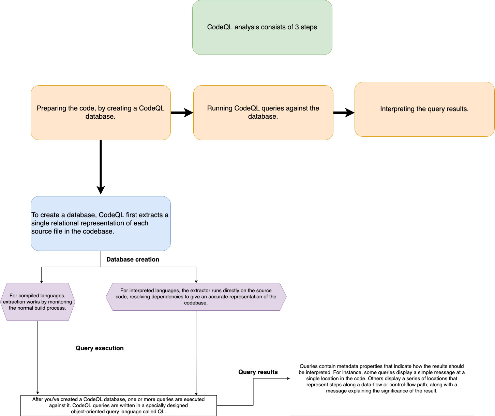

## Understand CodeQL and how it analyzes code.

CodeQL identifies  vulnerabilities and bugs in software code. It works by analyzing the code and looking for potential issues that could lead to security breaches or errors in the program. 

CodeQL can understand the structure and behavior of different programming languages, allowing it to detect complex problems that might be hard to spot manually.

Think of CodeQL as a smart detective that examines your code line by line, checking for common mistakes, security flaws. It can find things like unsafe data handling, code injection vulnerabilities, and potential software crashes.

CodeQL helps ensure that the code you write is more secure, reliable, and free from common programming mistakes.

## CodeQL analysis consists of three steps:

**Preparing the code, by creating a CodeQL database.**
**Running CodeQL queries against the database.**
**Interpreting the query results.**

### What is [Variant Analysis](./variant-analysis.md)

In CodeQL, code is treated like data. Security vulnerabilities, bugs, and other errors are modeled as queries.

There are three default query suites for CodeQL:

- code-scanning: queries run by default in CodeQL code scanning on GitHub.
- security-extended: queries from code-scanning, plus extra security queries with slightly lower precision and severity.
- security-and-quality: queries from code-scanning, security-extended, plus extra maintainability and reliability queries.

## Understand QL, a unique logic programming language.

## Set up CodeQL based code scanning in a GitHub repository.

## Reference a custom CodeQL query.

## Configure the language matrix in a CodeQL workflow.

## Learn how to use the CodeQL CLI to generate code scanning results and upload them to GitHub.

You can use three different commands to generate results and upload them to GitHub:

- `database create` to create a CodeQL database to represent the hierarchical structure of each supported programming language in the repository.
- `database analyze` to run queries to analyze each CodeQL database and summarize the results in a SARIF file.
- `github upload-results` to upload the resulting SARIF files to GitHub where the results are matched to a branch or pull request and displayed as code scanning alerts.

## Implement custom build steps.
